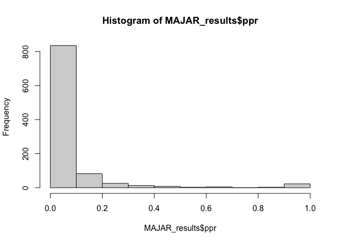

<!-- README.md is generated from README.Rmd. Please edit that file -->

# MAJAR

*Yuhan Xie, Song Zhai, Wei Jiang, Hongyu Zhao, Devan V. Mehrotra, Judong
Shen*  
<!-- badges: start --> <!-- badges: end -->

We propose MAJAR (Meta-Analysis of Joint effect Associations for
biomarker Replicability assessment) to jointly test prognostic and
predictive effects in meta-analysis without the need of using an
independent cohort for replication of the detected biomarkers. MAJAR
builds upon a two-dimensional hierarchical mixture model and adopts an
efficiently-implemented Expectation-Maximization (EM) algorithm for
parameter estimation. It provides posterior probabilities of
replicability (PPRs) and Bayesian false discovery rates (Fdr) for all
biomarkers tested.

## Source

Before using MAJAR, please downloaded the MAJAR software and source the
scripts

``` r
Rcpp::sourceCpp("src/file.cpp")
#> Registered S3 methods overwritten by 'RcppEigen':
#>   method               from         
#>   predict.fastLm       RcppArmadillo
#>   print.fastLm         RcppArmadillo
#>   summary.fastLm       RcppArmadillo
#>   print.summary.fastLm RcppArmadillo
source("R/MAJAR.R")
#> Loading required package: MASS
#> Loading required package: dplyr
#> 
#> Attaching package: 'dplyr'
#> The following object is masked from 'package:MASS':
#> 
#>     select
#> The following objects are masked from 'package:stats':
#> 
#>     filter, lag
#> The following objects are masked from 'package:base':
#> 
#>     intersect, setdiff, setequal, union
#> Loading required package: Rcpp
#> Loading required package: RcppArmadillo
#> Loading required package: parallel
#> Loading required package: TMB
#> Loading required package: optimParallel
source("R/Simulation.R")
#> Loading required package: data.table
#> 
#> Attaching package: 'data.table'
#> The following objects are masked from 'package:dplyr':
#> 
#>     between, first, last
#> Loading required package: mvtnorm
```

## Example

This is a basic example which shows you how to solve a common problem:

1.  An example of simulation under MAJAR’s data generation process.

``` r
M_real = 1000
K_real = 5
p_real =0.1
h2_real = 0.1
rho_real = 0.5
alpha_real = 2
data_real = "random" 
DGP = "MAJAR"
lambda_real = 0.1
data_simu_mamba_PGx<-generate_data_DGP(M=M_real,K=K_real,
                                       p=p_real,
                                       data=data_real,
                                       h2=h2_real,
                                       alpha=alpha_real,
                                       lambda = lambda_real,
                                       rho=rho_real,
                                       model = DGP)
betajk_G<-data_simu_mamba_PGx$betajk_G
betajk_GT<-data_simu_mamba_PGx$betajk_GT
sjk2_G<-data_simu_mamba_PGx$sjk2_G
sjk2_GT<-data_simu_mamba_PGx$sjk2_GT
```

2.  Run MAJAR.

``` r
MAJAR_results<-MAJAR(betajk_G, sjk2_G, 
                                     betajk_GT, sjk2_GT,
                                     p=0.1,#Rj~Bernoulli(pi)
                                     lambda=0.1,#Ojk~Bernoulli(lambda)
                                     tau2=0.001,
                                     alpha=1,
                                     rho=0,
                                     parcores = 4,
                                     minIter = 100,
                                     maxIter=1e4,
                                     tmp=10^6,
                                     transform=TRUE,
                                     fast_implement=TRUE)
```

3.  Check the results of MAJAR

``` r
hist(MAJAR_results$ppr)
```



``` r
print(paste0("The estimated replicable non-zero effect proportion:",round(MAJAR_results$p,3)))
#> [1] "The estimated replicable non-zero effect proportion:0.128"
print(paste0("The estimated outlier proportion:",round(MAJAR_results$lambda,3)))
#> [1] "The estimated outlier proportion:0.14"
print(paste0("The estimated inflation rate factor:",round(MAJAR_results$alpha,3)))
#> [1] "The estimated inflation rate factor:1.692"
print(paste0("The estimated heritability:",round(MAJAR_results$h2,3)))
#> [1] "The estimated heritability:0.093"
print(paste0("The estimated correlation between main and interaction effect:",round(MAJAR_results$rho,3)))
#> [1] "The estimated correlation between main and interaction effect:0.423"
```

``` r
MAJAR_results$Time
#> Time difference of 0.4936011 mins
```
